# Bella Italia 


[See live site](https://bellaitaliarestaurant-bfa3d8f4d24e.herokuapp.com)

[Admin page](https://bellaitaliarestaurant-bfa3d8f4d24e.herokuapp.com/admin/login/?next=/admin/)

## Admin credentials:
- Username: admin
- Password: admin

## Content
- [Introduction](#introduction)
- [User Stories](#user-stories)
    - [Completed User Stories](#completed-user-stories)
    - [Incomplete User Stories](#incomplete-user-stories)
    - [Classification of User Stories](#classification-of-user-stories)
- [Design](#design)
    - [Wireframes](#wireframes)
    - [Site Styling](#site-styling)
- [Site Content](#site-content)
- [Features](#features)
    - [Navigation](#navigation)
    - [Booking System](#booking-system)
    - [Day Specific Opening Hours](#day-specific-opening-hours)
    - [Menu](#menu)
- [Technologies Used](#technologies-used)
    - [HTML, CSS, JavaScript, Python, Django](#html-css-javascript-python-django)
    - [Packages](#packages)
    - [Tools and Programs Used](#tools-and-programs-used)
- [Testing](#testing)
    - [Validator Testing](#validator-testing)
    - [Lighthouse Tool](#lighthouse-tool)
    - [Manual Testing](#manual-testing)
- [Deployment](#deployment)
- [Credits](#credits)

## Introduction 

Bella Italia is a sophisticated restaurant designed to simplify the restaurant booking experience both for the user and owner.

### Project Overview 

 **User-Friendly Interface**: The streamlined and user-friendly interface integrates Google Fonts and Font Awesome icons to improve readability and navigation. It emphasizes usability, enabling users to effortlessly locate information and make reservations.

- **Dynamic Content Management**: Leveraging Django templates, the platform facilitates seamless updates of dynamic content, simplifying the upkeep of details concerning hotel amenities, accommodations, and local points of interest.

- **Navigation and Accessibility**: The website features a straightforward and accessible navigation bar that links to essential sections such as Home, Booking, About Jeri, My Bookings, Login, and Register. This ensures users can easily find the information they seek.

### Goals of the project

1. **Simple Booking**: Simplifying the booking process for convenience and effectiveness
2. **Enhanced User Experience**: Offering an intuitive interface for smooth navigation and engagement.
3. **Secure Data Handling**:  Guaranteeing the security of user data and reservation details.
4. **Accessibility and Integration**: Ensuring easy platform access and integrating external tools for enhanced capabilities.
5. **Optimized Performance**:Providing rapid loading speeds and fluid interactions to optimize user experience.

## User Stories

[All User Stories](https://github.com/linusapelgren/bellaitalia/issues)

### Completed User Stories
1. **As a User,** I want to be able to easily find and navigate through the website, so that I can quickly access information and make reservations.
2. **As a Restaurant Owner,** I want an admin page where I can manage reservations, so that I can easily track and update bookings.
3. **As a User,** I want to receive a confirmation message after making a reservation, so that I know my booking was successful.
4. **As a User,** I want to be able to cancel my reservation easily, so that I can manage my bookings without hassle.
5. **As a Developer,** I want to deploy the website to Heroku, so that it is available online for users.
6. **As a User,** I want to change my reservation details, so that I can update my booking if my plans change.
7. **As a Developer,** I want to implement Allauth, for account management.
8. **As a Restaurant Owner,** I want to have set opening hours, so that users can't book when the restaurant is closed.
9. **As a Restaurant Owner,** I want to be able to customize opening hours.

### Incomplete User Stories
1. **As a Restaurant Owner,** I want to be able to set specific opening hours for specific dates, like holidays.
2. **As a User,** I want to receive updates via messages about my reservation, so that I am informed about any changes or reminders.
3. **As a Restaurant Owner,** I want the system to prevent double bookings when the restaurant is full, so that overbooking is avoided.

### Classification of User Stories

#### Must Have
- Implement a working booking system.
- Deploy the website to Heroku.
- Create a database for storing user reservations.
- Implement an admin page for reservation management.
- Allow users to cancel bookings.
- Allow users to update their reservation details.
- Implement customization of opening hours

#### Could Have
- Implement SMS confirmation for reservations.
- Set specific opening hours on specific days.
- Prevent double booking when the restaurant is full.

## Epics and Milestones

### Epics

#### Epic 1: Website Navigation and User Experience
- **Milestone 1: Initial Website Setup and Deployment**
  - User Story 1: As a User, I want to be able to easily find and navigate through the website.
  - User Story 2: As a User, I want to change my reservation details.
  - User Story 3: As a Restaurant Owner, I want to have set opening hours.

#### Epic 2: Reservation System Management
- **Milestone 2: Core Reservation Features**
  - User Story 1: As a Restaurant Owner, I want an admin page where I can manage reservations.
  - User Story 2: As a User, I want to receive a confirmation message after making a reservation.
  - User Story 3: As a User, I want to be able to cancel my reservation easily.
  - User Story 4: As a Developer, I want to implement Allauth for account management.
  - User Story 5:  As a Restaurant Owner, I want an admin page where I can manage opening hours.

#### Epic 3: System Enhancements and Integrations
- **Milestone 3: Advanced Features and Final Improvements**
  - Incomplete User Story 1: As a Restaurant Owner, I want to be able to set specific opening hours for specific dates.
  - Incomplete User Story 2: As a User, I want to receive updates via messages about my reservation.
  - Incomplete User Story 3: As a Restaurant Owner, I want the system to prevent double bookings when the restaurant is full.

## Bugs & Future Features

At this date no Unfixed bugs

### Future Features
- Prevent double booking when restaurant is full
- Set specific opening hours on specific days

## Testing

## Validator testing


- HTML
  - No errors were returned when passing through the official [W3C validator](https://validator.w3.org/nu/?doc=https%3A%2F%2Fbellaitaliarestaurant-bfa3d8f4d24e.herokuapp.com)
  - One warning was returned but I didn't fix it since that would ruin the look of the page

  

- CSS
  - No errors were found when passing through the official [(Jigsaw) validator](https://jigsaw.w3.org/css-validator)

  

## Lighthouse Tool

## Desktop 

## Landing Page

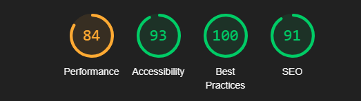

## Menu Page

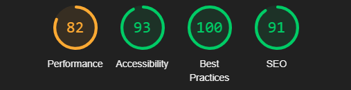

## Reservation Page

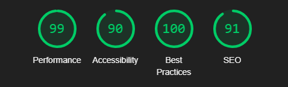

## Reservation Confirmation Page

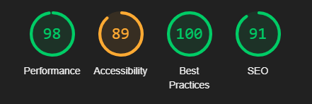

## Cancel Reservation Page

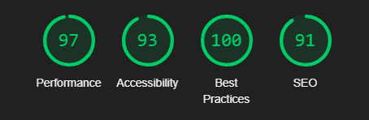

## Edit Reservation Page

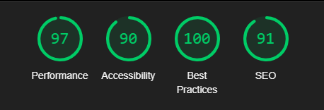

## Profile Page


## About Page

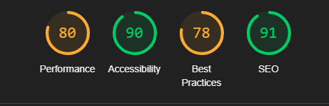

## Mobile Phone

## Landing Page

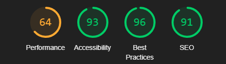

## Menu Page

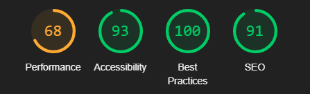

## Reservation Page

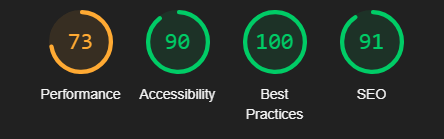

## Reservation Confirmation Page

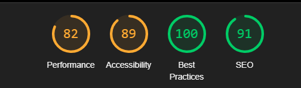

## Cancel Reservation Page

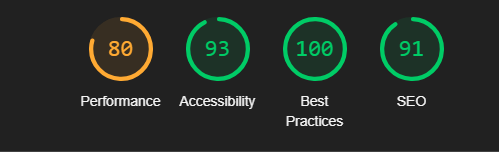

## Edit Reservation Page

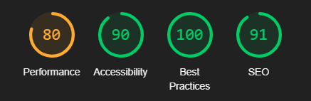

## Profile Page

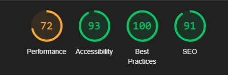

## About Page

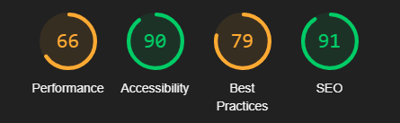

## Manual testing
I conducted a lot of tests during programming. I used a live preview to check if everything i programmed functioned as intended

### Navigation
| Feature Tested  | Outcome  | Test Performed  | Result  | Pass/Fail  |
|---|---|---|---|---|
|  Home | Display the Home page| Click site logo | Taken to the Home page | Pass  |
|  Booking | Display the Booking page| Click Booking | Taken to the Booking page | Pass  |
|  About | Display the About page| Click About | Taken to the About page | Pass  |
|  Profile | Display the Profile page| Click the profile dropdown and then Profile | Taken to the Profile page | Pass  |

### Profile
| Feature Tested  | Outcome  | Test Performed  | Result  | Pass/Fail  |
|---|---|---|---|---|
|  Logout | Logs out the user | Click the logout button in the account dropdown | Gets logged out | Pass |
|  Login | Logs in the user | Click the login button in the account dropdown | Taken to login page then gets logged in after filling it out | Pass |
|  Register | Registers the user | Click the register button in the account dropdown | Taken to register page then gets logged in after filling it out | Pass |

### Reservations
| Feature Tested  | Outcome  | Test Performed  | Result  | Pass/Fail  |
|---|---|---|---|---|
|  Opening hours | The right times should be shown based on what day you picked | Select a date and then look in the time picker | Correct opening hours shown | Pass |
|  Booking | The reservation gets made and saved in profile and admin | Fill out the form and click book | Reservation gets made and saved | Pass |
|  Cancel reservation | The reservation gets removed | On the profile page click cancel beside your reservation | Reservation cancelled | Pass |
|  Change reservation | The reservation gets updated | On the profile page click edit beside your reservation then fill out the form and click update | Reservation updated | Pass |
|  Twilio | Message gets sent to user when making a reservation | Fill out the form and click book | Message sent | Pass |

### Side note
- The messaging may not work outside of Sweden

### Testing on different screen sizes
I used my browser tools to check how the page looked on different devices

## Wireframes 

## Desktop 

## Landing Page


## Menu Page


## Reservation Page


## Profile Page


## About Page


## Mobile Phone

## Landing Page


## Menu Page


## Reservation Page


## Profile Page


## About Page


## Site content 

## Desktop 

## Landing Page


## Menu Page


## Reservation Page


## Profile Page


## About Page


## Mobile Phone

## Landing Page


## Menu Page


## Reservation Page


## Profile Page


## About Page


## Features:

## Existing Features 

## Navigation


## Booking System

## Make reservation


## Reservation form


## Cancel reservation


## Change reservation


## Opening hours

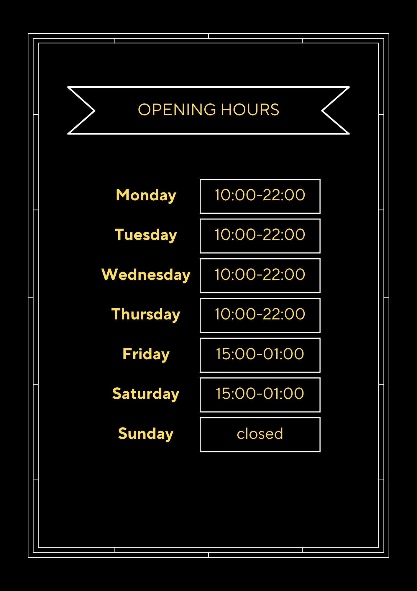

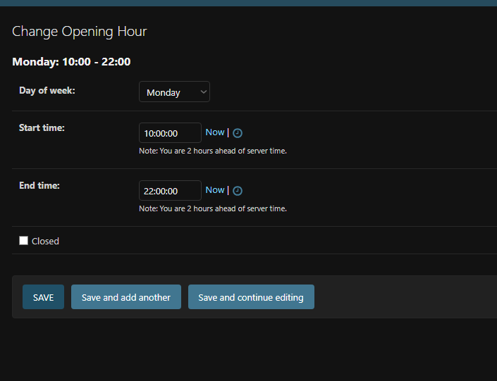

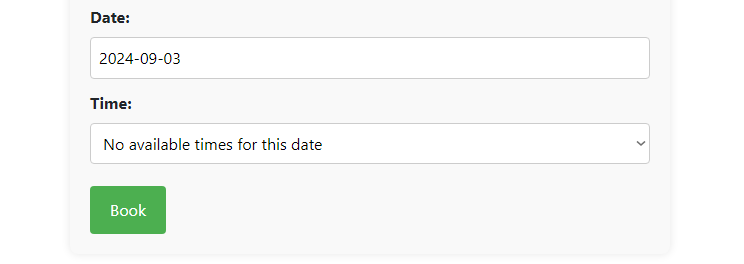

## Menu:
  


## Technologies Used 

- **HTML**: Used for the main site content.
- **CSS**: Used for the main site design and layout.
- **JavaScript**: Used for user interaction on the site .
- **Python**: Used as the back-end programming language.
- **Git**: Used for version control (git add, git commit, git push).
- **GitHub**: Used for secure online code storage.
- **Gitpod**: Used as a cloud-based IDE for development.
- **Django**: Used as the Python framework for the site.
- **PostgreSQL**: Used as the relational database management.
- **Heroku Postrgres** Add-on for Heroku app
- **Heroku**: Used for hosting the deployed back-end site.
- **Paint**: Used to design my site wireframes.
- **Canva** Used to make assets for my website
- **Pexels** Used for stock images for the site
- **Twilio** For sending booking conformations
 

## Deployment

This website is deployed to Heroku from a GitHub repository. The following steps were taken:

### Creating Repository on GitHub

1. First, make sure you are signed into GitHub and go to the [Code Institute's template](https://github.com/Code-Institute-Org/gitpod-full-template).
2. Then click on "use this template" and select "Create a new repository" from the drop-down. Enter the name for the repository and click "Create repository from template".
3. Once the repository was created, I clicked the green Gitpod button to create a workspace in Gitpod so that I could write the code for the site.

### Creating an app on Heroku

1. After creating the repository on GitHub, head over to [Heroku](https://www.heroku.com/) and sign in.
2. On the home page, click "New" and select "Create new app" from the drop-down.
3. Give the app a name (this must be unique) and select a region. I chose Europe as I am in Europe. Then click "Create app".

### Add heroku postgres to heroku app 

1. On your Heroku dashboard click configure add-ons 
2. Click find more add-ons
3. Scroll down until you find Heroku Postgres
4. Click the Install Heroku Postgres button
5. Choose app to provision the add-on to 
6. Go back to your app dashboard and click settings
7. Click reveal config vars and copy the HEROKU_POSTGRESQL_AMBER_URL and add the value to DATABASE_URL
4. Head over to Gitpod and create a Database URL environment variable in your `.env` file and set it equal to the copied URL.

### Deploying to Heroku

1. Head back over to Heroku and click on your app and then go to the "Settings" tab.
2. On the settings page, scroll down to the "config vars" section and enter the following:
   - `DATABASE_URL`: which you will set equal to the ElephantSQL URL.
   - `Secret key`: this can be anything.
   - `CLOUDINARY_URL`: this will be set to your Cloudinary URL.
   - `Port`: which will be set to 8000.
3. Then scroll to the top and go to the "Deploy" tab and go down to the "Deployment method" section and select GitHub and then sign into your account.
4. Below that in the "search for a repository to connect to" search box enter the name of your repository that you created on GitHub and click connect.
5. Once it has been connected scroll down to the "Manual Deploy" and click "Deploy branch". When it has deployed you will see a "view app" button below and this will bring you to your newly deployed app.
Please note that when deploying manually you will have to deploy after each change you make to your repository.

Heroku needs two additional files in order to deploy properly:
- `requirements.txt`
- `Procfile`

You can install this project's requirements (where applicable) using:


- pip3 install -r requirements.txt

 - If you have your own packages that have been installed, then the requirements file needs to be updated using:
  - pip3 freeze --local > requirements.txt
The Procfile can be created with the following command:
 - echo web: gunicorn app_name.wsgi > Procfile

 Replace `app_name` with the name of your primary Django app; the folder where `settings.py` is located.

For Heroku deployment, follow these steps to connect your own GitHub repository to the newly created app:

- Either:
  - Select Automatic Deployment from the Heroku app.
  - Or:
    In the Terminal/CLI, connect to Heroku using this command:
    ```
    heroku login -i
    ```
  - heroku login -i

  - heroku git:remote -a app_name

After performing the standard Git add, commit, and push to GitHub, you can now type:

- git push heroku main

### Credits
- Pexels for the stock images